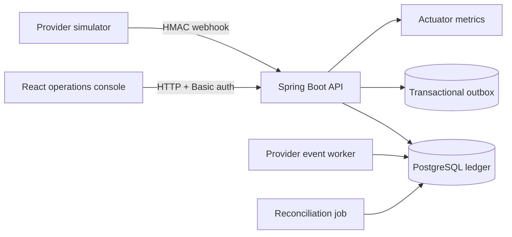

# FinTech Payment Ledger

A portfolio-grade wallet and payment ledger that demonstrates the accounting and reliability concerns behind money movement. The implementation uses append-only double-entry postings, integer minor units, transaction-scoped balance updates, idempotency, signed provider webhooks, FX quotes, reversals, reconciliation, and operational invariants.

The default profile runs entirely in memory for a fast demo. The PostgreSQL profile adds database triggers that reject ledger mutation and defer the zero-sum check until transaction commit.

## System shape



## Accounting guarantees

- Every posted transaction contains at least two non-zero entries.
- Entry amounts sum to zero independently for each currency.
- User balances cannot become negative.
- Money is stored as signed integer minor units; FX rates use fixed precision.
- Posted entries are never edited or deleted. Corrections create a linked reversal.
- Idempotency keys are persisted with a request fingerprint. A replay returns the original transaction; a changed payload is rejected.
- Ledger entries, balance snapshots, and outbox messages commit in one database transaction.
- Provider event IDs and payload hashes make webhook delivery safe to retry.

The detailed rules and posting examples are in [docs/accounting-model.md](docs/accounting-model.md).

## Technology

- Java 21 and Spring Boot
- Spring JDBC, Flyway, Spring Security, and Actuator
- PostgreSQL for production-like storage; H2 in PostgreSQL compatibility mode for local demos and tests
- React, TypeScript, Vite, and Lucide icons
- Docker Compose and GitHub Actions

## Quick start

### API with the in-memory database

Requirements: Java 21.

```bash
./mvnw spring-boot:run
```

On Windows PowerShell:

```powershell
.\mvnw.cmd spring-boot:run
```

The API starts at `http://localhost:8080`. Default demo credentials are:

| Role | Username | Password |
| --- | --- | --- |
| Wallet user | `wallet-user` | `wallet-demo` |
| Operations administrator | `ledger-admin` | `admin-demo` |

These defaults are deliberately convenient for local evaluation. Replace them before any deployment.

### Web console

Requirements: Node.js 24 and pnpm 11.

```bash
cd web
pnpm install --frozen-lockfile
pnpm dev
```

Open `http://localhost:5173`. Vite proxies API and health requests to port 8080.

### Full stack with PostgreSQL

```bash
cp .env.example .env
docker compose up --build
```

Open `http://localhost:8080`. The image compiles the React console into Spring Boot's static resources and enables the PostgreSQL profile.

## Demonstration path

1. Create two wallets with GBP and EUR accounts.
2. Deposit funds into the first wallet.
3. Replay the exact request with the same idempotency key and observe the same transaction ID.
4. Transfer funds to the second wallet.
5. Request and execute a GBP/EUR quote.
6. Reverse a posted transaction and inspect the compensating entries.
7. Load a statement to see its running balance.
8. Run the administrator invariant check and a reconciliation job.

Ready-to-run HTTP examples are in [docs/api-examples.http](docs/api-examples.http), and the narrated walkthrough is in [docs/demo.md](docs/demo.md).

## API surface

| Method | Endpoint | Purpose |
| --- | --- | --- |
| `POST` | `/api/wallets` | Create a wallet and currency accounts |
| `GET` | `/api/wallets/{id}/balances` | Read posted and available balances |
| `GET` | `/api/wallets/{id}/statement` | Read a cursor-ready running statement |
| `POST` | `/api/deposits` | Post a provider-backed deposit |
| `POST` | `/api/transfers` | Move funds between wallets |
| `POST` | `/api/fx/quotes` | Create a short-lived FX quote |
| `POST` | `/api/conversions` | Consume an FX quote once |
| `POST` | `/api/transactions/{id}/reversals` | Create compensating entries |
| `POST` | `/api/provider/webhooks` | Accept a signed, replay-safe provider event |
| `POST` | `/api/admin/reconciliation/run` | Compare settlements with local postings |
| `GET` | `/api/admin/invariants` | Check balance and outbox health |
| `GET` | `/api/admin/audit-logs` | Read privileged-operation audit records |

All money-moving HTTP requests require an `Idempotency-Key` header. Administrative reconciliation also requires `X-Audit-Reason`.

## Tests

```bash
./mvnw test
cd web && pnpm build
```

The backend suite covers randomized balancing, replay and conflict semantics, transfers, FX, reversals, statement balances, concurrent overspend prevention, webhook signature and duplicate handling, reconciliation categories, and invariant health.

## Documentation

- [Architecture](docs/architecture.md)
- [Accounting model](docs/accounting-model.md)
- [Threat model](docs/threat-model.md)
- [Signed minor-unit decision](docs/adr/0001-signed-minor-units.md)
- [Demo walkthrough](docs/demo.md)
- [Changelog](CHANGELOG.md)

## Scope boundaries

This repository is a coherent portfolio MVP, not a licensed payment product. Authentication is intentionally local, the outbox is persisted but has no external broker adapter, authorization is role-based rather than tenant-scoped, and the provider implementation is a simulator. The threat model identifies the controls required before production use.

## License

MIT
