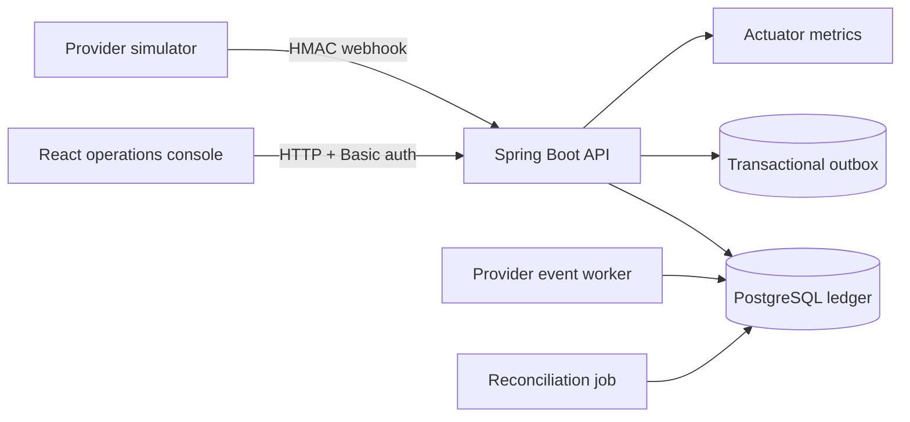

# FinTech Payment Ledger

A self-hosted wallet and payment-ledger reference application that demonstrates the accounting, security, and reliability concerns behind money movement. The implementation uses append-only double-entry postings, integer minor units, transaction-scoped balance updates, idempotency, signed provider webhooks, subject-owned resources, FX quotes, reversals, reconciliation, and operational invariants.

The full Docker stack starts with one command and includes the English operations console, API, PostgreSQL, schema migrations, health checks, and persistent storage. The default Java profile remains an in-memory development option.

## Run it now

Requirements: Docker Engine with Compose v2.

```bash
git clone https://github.com/QihuiPan/fintech-payment-ledger.git
cd fintech-payment-ledger
docker compose up --build --wait
```

Open `http://localhost:8080`, then select **Create demo workspace**. The console creates two wallets, funds the first with GBP 100.00, fills the transfer destination, and displays the balanced ledger entries.

Default local credentials:

| Role | Username | Password |
| --- | --- | --- |
| Wallet user | `wallet-user` | `wallet-demo` |
| Operations administrator | `ledger-admin` | `admin-demo` |

The demo service binds only to `127.0.0.1`. Use the [deployment guide](docs/deployment.md) before exposing it to a network.

## System shape



## Accounting guarantees

- Every posted transaction contains at least two non-zero entries.
- Entry amounts sum to zero independently for each currency.
- User balances cannot become negative.
- Money is stored as signed integer minor units; FX rates use fixed precision.
- Posted entries are never edited or deleted. Corrections create a linked reversal.
- Idempotency keys are persisted with a request fingerprint. A replay returns the original transaction; a changed payload is rejected.
- Ledger entries, balance snapshots, and outbox messages commit in one database transaction.
- Provider event IDs and payload hashes make webhook delivery safe to retry.
- Wallets and initiated transactions are isolated by the authenticated API subject; administrators retain cross-wallet access.

The detailed rules and posting examples are in [docs/accounting-model.md](docs/accounting-model.md).

## Technology

- Java 21 and Spring Boot
- Spring JDBC, Flyway, Spring Security, and Actuator
- PostgreSQL for production-like storage; H2 in PostgreSQL compatibility mode for local demos and tests
- React, TypeScript, Vite, and Lucide icons
- Docker Compose and GitHub Actions
- Multi-architecture images published to GitHub Container Registry

## Development

### API with the in-memory database

Requirements: Java 21.

```bash
./mvnw spring-boot:run -Dspring-boot.run.profiles=local
```

On Windows PowerShell:

```powershell
.\mvnw.cmd spring-boot:run -Dspring-boot.run.profiles=local
```

The API starts at `http://localhost:8080`. The optional local profile enables the H2 console at `/dev/h2-console`; it is disabled in every other profile.

### Web console

Requirements: Node.js 24 and pnpm 11.

```bash
cd web
pnpm install --frozen-lockfile
pnpm dev
```

Open `http://localhost:5173`. Vite proxies API and health requests to port 8080.

### Full stack using the prebuilt image

```bash
docker compose pull
docker compose up --no-build --wait
```

The image compiles the React console into Spring Boot's static resources and enables PostgreSQL. To stop the stack without deleting data, run `docker compose down`.

## Demonstration path

1. Select **Create demo workspace** to create two wallets and fund the first one.
2. Inspect the deposit's balanced entries and the running statement.
3. Replay the exact request with the same idempotency key and observe the same transaction ID.
4. Transfer funds to the second wallet.
5. Request and execute a GBP/EUR quote.
6. Reverse a posted transaction and inspect the compensating entries.
7. Load a statement to see its running balance.
8. Run the administrator invariant check and a reconciliation job.

Ready-to-run HTTP examples are in [docs/api-examples.http](docs/api-examples.http), the complete machine-readable contract is [OpenAPI 3.1](src/main/resources/static/openapi.yaml), and the narrated walkthrough is in [docs/demo.md](docs/demo.md). A running packaged application also serves the contract at `http://localhost:8080/openapi.yaml`.

## API surface

| Method | Endpoint | Purpose |
| --- | --- | --- |
| `POST` | `/api/wallets` | Create a wallet and currency accounts |
| `GET` | `/api/wallets/{id}/balances` | Read posted and available balances |
| `GET` | `/api/wallets/{id}/statement` | Read a cursor-ready running statement |
| `POST` | `/api/deposits` | Post a provider-backed deposit |
| `POST` | `/api/transfers` | Move funds between wallets |
| `POST` | `/api/fx/quotes` | Create a short-lived FX quote |
| `POST` | `/api/conversions` | Consume an FX quote once |
| `POST` | `/api/transactions/{id}/reversals` | Create compensating entries |
| `POST` | `/api/provider/webhooks` | Accept a signed, replay-safe provider event |
| `POST` | `/api/admin/reconciliation/run` | Compare settlements with local postings |
| `GET` | `/api/admin/invariants` | Check balance and outbox health |
| `GET` | `/api/admin/audit-logs` | Read privileged-operation audit records |

All money-moving HTTP requests require an `Idempotency-Key` header. Administrative reconciliation also requires `X-Audit-Reason`.

## Tests

```bash
./mvnw test
cd web && pnpm build
```

The backend suite covers randomized balancing, replay and conflict semantics, subject ownership, transfers, FX, reversals, statement balances, concurrent overspend prevention, webhook signature and duplicate handling, reconciliation categories, and invariant health. CI also builds the deployable container image.

## Documentation

- [Engineering portfolio and downloadable PDF](docs/portfolio/README.md)
- [Architecture](docs/architecture.md)
- [Accounting model](docs/accounting-model.md)
- [Threat model](docs/threat-model.md)
- [Deployment guide](docs/deployment.md)
- [Security policy](SECURITY.md)
- [OpenAPI contract](src/main/resources/static/openapi.yaml)
- [Signed minor-unit decision](docs/adr/0001-signed-minor-units.md)
- [Demo walkthrough](docs/demo.md)
- [Changelog](CHANGELOG.md)

## Scope boundaries

This repository is directly usable as a self-hosted reference application, but it is not a licensed payment product. Authentication uses a configurable in-memory Basic-auth directory, the outbox is persisted but has no external broker adapter, and the provider implementation is a simulator. The [threat model](docs/threat-model.md) identifies the additional identity, compliance, availability, and operations controls required before processing real money.

## License

MIT
