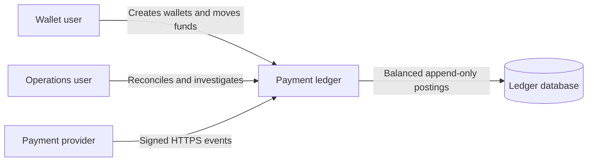
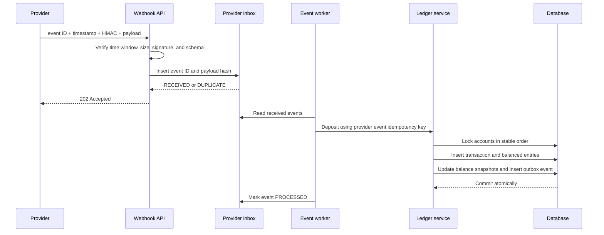

# Architecture

## Context

The system models the accounting core behind a multi-currency wallet. PostgreSQL is the source of truth; balances are projections updated in the same transaction as immutable entries. External providers communicate through a narrow, signed webhook boundary.

## Components

| Component | Responsibility | Failure boundary |
| --- | --- | --- |
| React console | Demonstrates supported wallet and operations flows | Contains no authoritative financial state |
| API controllers | Validate transport input and apply role checks | Reject malformed or unauthorized requests before services |
| Payment services | Define posting rules, idempotency, FX consumption, and reversals | A database transaction encloses every posting |
| Ledger service | Validates entries, locks accounts in stable order, and commits entries, balances, and outbox | Any invariant failure rolls back the whole posting |
| JDBC repository | Executes explicit SQL and maps durable records | Database constraints are the final guard |
| Provider inbox worker | Separates fast webhook acceptance from ledger work | Failed events are quarantined with an error |
| Reconciliation service | Compares provider settlement rows with local deposits | Exceptions are persisted for investigation |
| Actuator and audit log | Exposes health, metrics, and privileged-action evidence | No financial mutation is permitted through observability routes |

## Deposit sequence

## Concurrency strategy

Accounts are locked with `SELECT ... FOR UPDATE` in sorted UUID order. A transfer therefore serializes against every competing operation that touches the same account, while stable ordering avoids lock inversion. The available-balance check happens after the lock is acquired and before any insert.

The idempotency record is the ledger transaction itself: the key is unique and stores a SHA-256 request fingerprint. A matching retry returns the durable result. A different fingerprint returns a conflict.

## Database enforcement

The common Flyway migration supports H2 and PostgreSQL. The PostgreSQL-only migration adds:

- triggers that reject updates and deletes on ledger transactions and entries;
- a deferred constraint trigger that calculates the entry sum per transaction and currency at commit time;
- table checks that prevent negative user account projections.

Service checks provide precise API errors. Database constraints protect against future application bugs and direct SQL mistakes.

## Scaling path

The portfolio MVP intentionally runs the provider worker in the API process. A production deployment would claim inbox rows with `FOR UPDATE SKIP LOCKED`, run workers independently, publish the outbox to a broker, use tenant-scoped authorization, and partition high-volume entry and audit tables by time or account hash. None of those changes require changing the accounting model.
